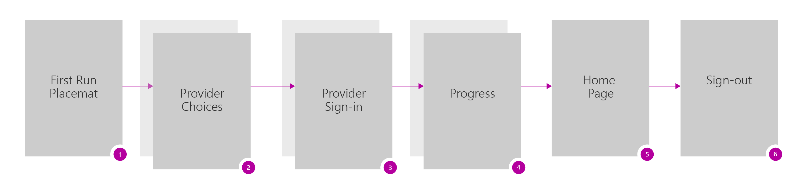
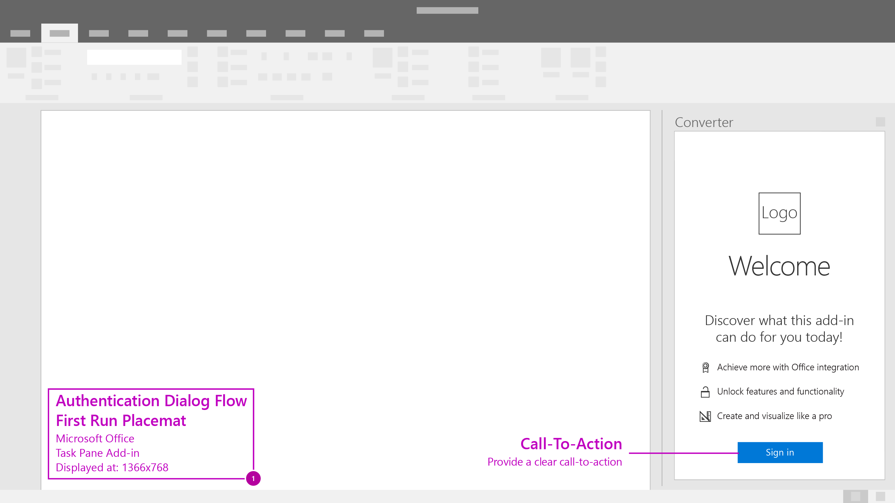
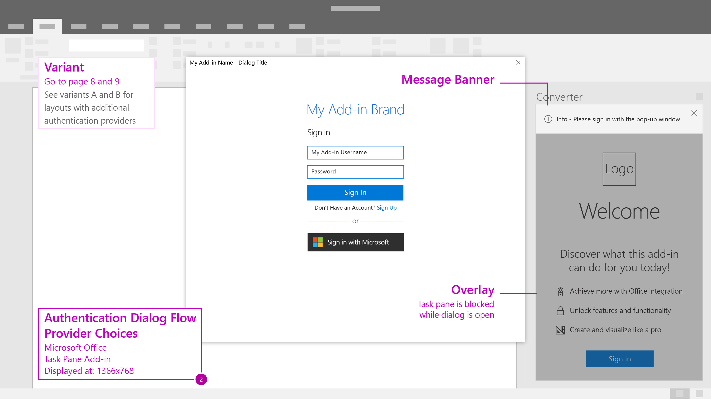
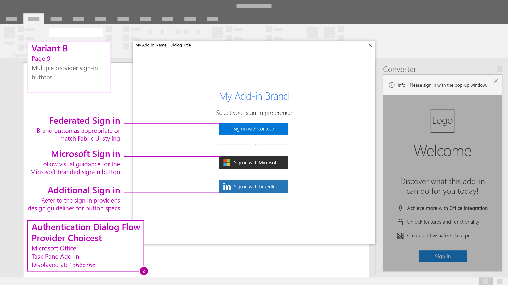

# Authentication Dialog Flow - Multiple Identity Providers

Use dialogs to present authentication screens to your end users. Consider this UX design pattern when using **multiple identity providers** or your add-in has **no space to display branded sign-in buttons**. Compare to [single identity provider ux design pattern](auth-single.md).

## More Details

- **Microsoft Branded Sign-in Button** - When using Microsoft's Identity service you'll have the opportunity to use a branded sign-in button that is customizable to light and dark themes. [Learn more](https://azure.microsoft.com/en-us/documentation/articles/active-directory-branding-guidelines/#visual-guidance-for-sign-in).
- **Company Branding** - Azure Active Directory allows customization of sign-in and access panel pages for consistent look and feel with your services. [Learn More](https://azure.microsoft.com/en-us/documentation/articles/active-directory-add-company-branding/).
- **Dialog Sizing** - Target your dialogs to a few key widths or breakpoints for better responsive design. [Learn more](https://msdn.microsoft.com/windows/uwp/layout/screen-sizes-and-breakpoints-for-responsive-design)

***

Recommended screen flow for when using multiple identity providers in your add-in.

1. First Run Placemat - The screen contains a clear call to action, "Sign-in"

2. Provider Choices - End users are presented with a set of identity providers to choose from, including an authentication form. Note that the add-in UI is on hold until the dialog closes.

3. Provider Sign-in - The identity provider will have their own UI. Microsoft Azure Active Directory allows customization of sign-in and access panel pages for consistent look and feel with your service. [Learn More](https://azure.microsoft.com/en-us/documentation/articles/active-directory-add-company-branding/).

4. Progress - Indicate progress while settings and UI load. 

5. Home Page - Land your users on a useful home page to begin their add-in experience.

6. Sign-out - Include a discoverable entry point for users to manage their profile.

7. Provider Choices Variant A - Authentication form with multiple provider sign-in buttons.

7. Provider Choices Variant B - Multiple provider sign-in buttons.
