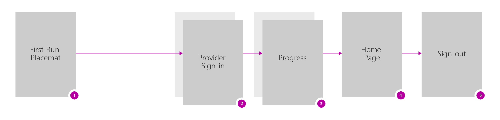
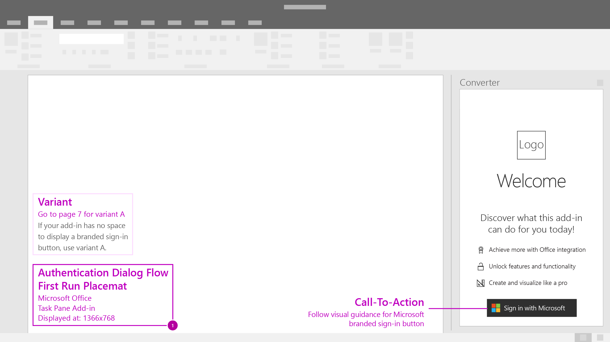
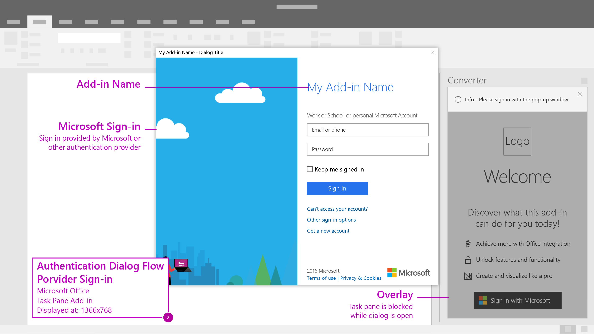
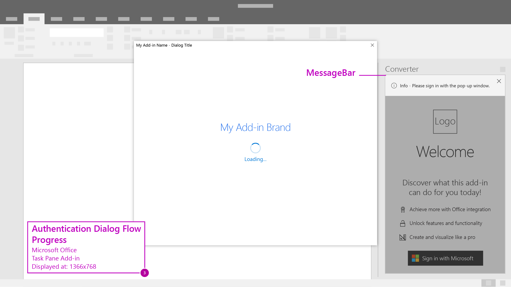
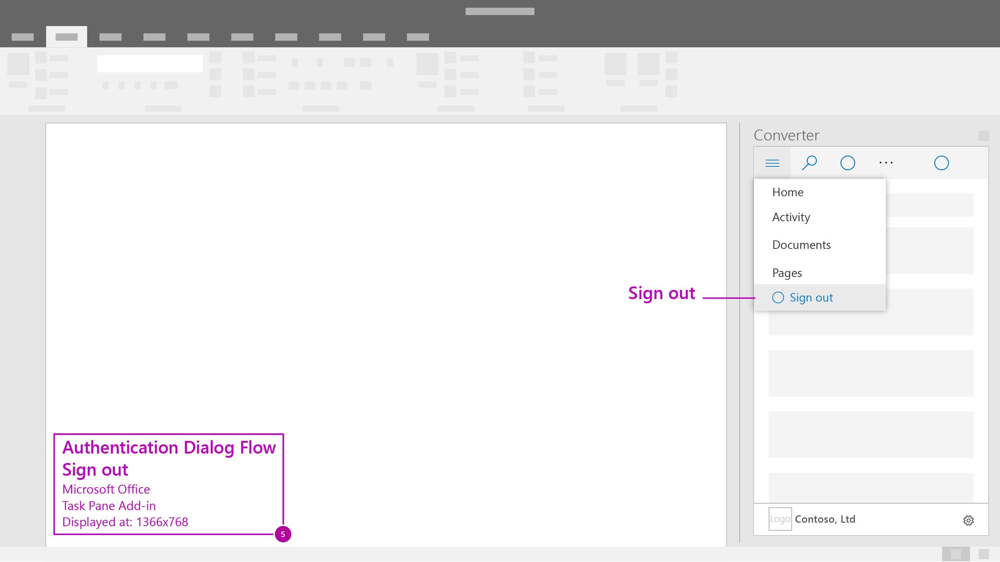

# Authentication Dialog Flow - Single Identity Provider

Use dialogs to present authentication screens to your end users. Consider this UX design pattern when using a **single identity provider** and your add-in has **space to display that provider's button**. Compare to the [multiple identity providers ux design pattern](auth-multi.md).

## More Details

- **Microsoft Branded Sign-in Button** - When using Microsoft's Identity service you'll have the opportunity to use a branded sign-in button that is customizable to light and dark themes. [Learn more](https://azure.microsoft.com/en-us/documentation/articles/active-directory-branding-guidelines/#visual-guidance-for-sign-in).
- **Company Branding** - Azure Active Directory allows customization of sign-in and access panel pages for consistent look and feel with your services. [Learn More](https://azure.microsoft.com/en-us/documentation/articles/active-directory-add-company-branding/).
- **Dialog Sizing** - Target your dialogs to a few key widths or breakpoints for better responsive design. [Learn more](https://msdn.microsoft.com/windows/uwp/layout/screen-sizes-and-breakpoints-for-responsive-design)

***

Recommended screen flow for when using a single identity provider in your add-in.

1. First Run Placemat - Place the branded sign-in button as a clear call-to action inside your add-in's UI.

2. Provider Sign-in - The identity provider will have their own UI. Microsoft Azure Active Directory allows customization of sign-in and access panel pages for consistent look and feel with your service. [Learn More](https://azure.microsoft.com/en-us/documentation/articles/active-directory-add-company-branding/).

3. Progress - Indicate progress while settings and UI load.

4. Home Page - Land your users on a useful home page to begin their add-in experience.

5. Sign-out - Include a discoverable entry point for users to manage their profile.

