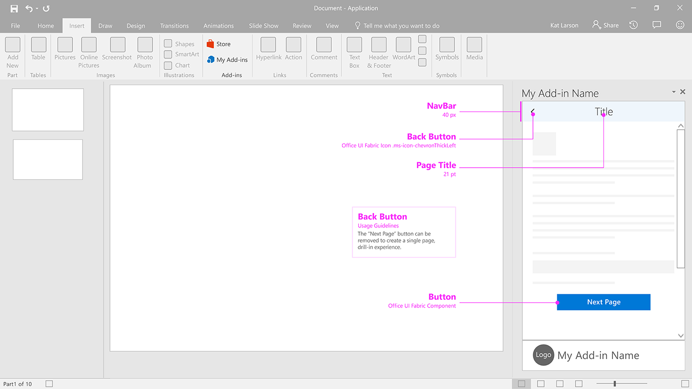

# Back Button

The back button allows users to recover from a drill down navigational action. This pattern helps ensure users follow an ordered series of steps.  

#### Code sample
* [Back button code sample](../templates/navigation/back-button)

***

Specifications for desktop task pane 
