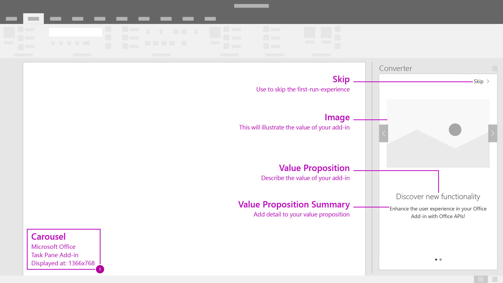
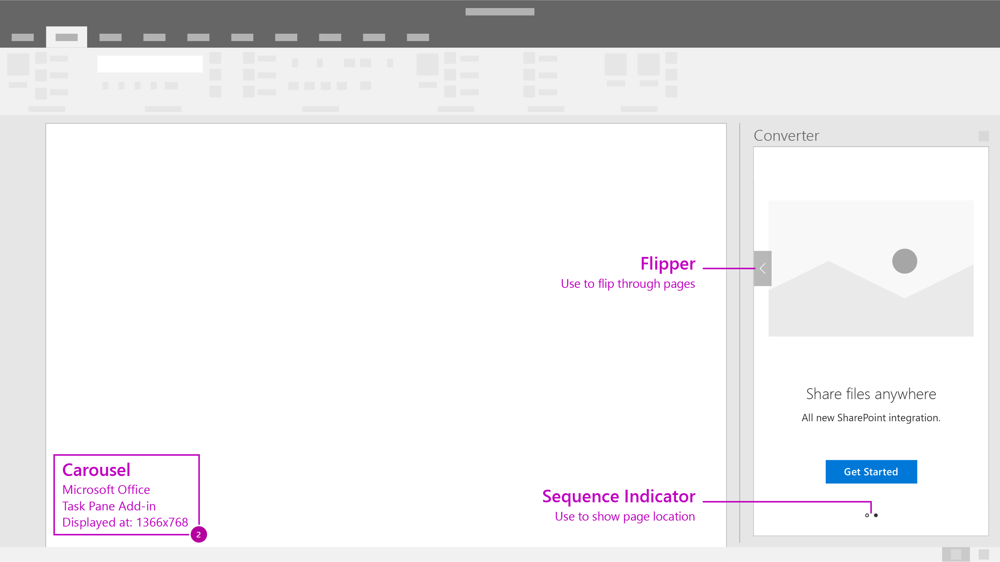

# Carousel

Carousel takes users through a series of features or information pages before they start using the add-in.

#### Code sample
* [Carousel code sample](../templates/first-run/carousel)

***

Recommended screen flow for when using a single identity provider in your add-in. 

1. Carousel - Allow users to advance or skip the beginning pages of the carousel flow. 

2. Carousel - Provide a clear call to action to exit the first-run-experience.
