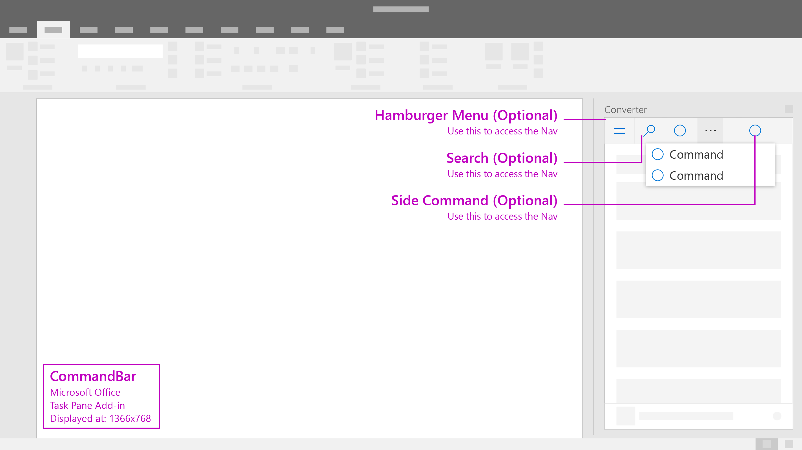

# Command Bar

CommandBar is a surface that houses commands that operate on the content of the window, panel, or parent region it resides above. Optional features include a hamburger menu access point, search, and side commands. 

> The **Command Bar** pattern replaces the **Nav**, **Navigation and Commands**, and **Commands** patterns.

#### Code sample
* [Command bar code sample](../templates/utility/command-bar)

***

Specifications for desktop task pane 
