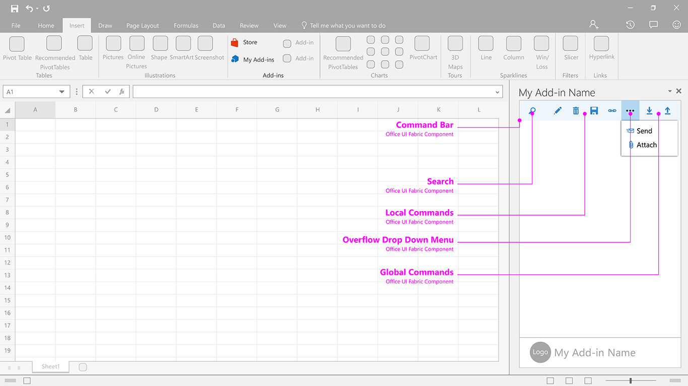

### Commands

Shows how to present the command bar in your add-in.

Current Fabric Version Used: [2.6.1](https://github.com/OfficeDev/office-ui-fabric-core/releases/tag/2.6.1)

* [Download .Ai (Adobe Illustrator) file](https://github.com/OfficeDev/Office-Add-in-UX-Design-Patterns/blob/master/Patterns/Source%20Files/Commands.ai?raw=true)

***

Specifications for desktop task pane 
