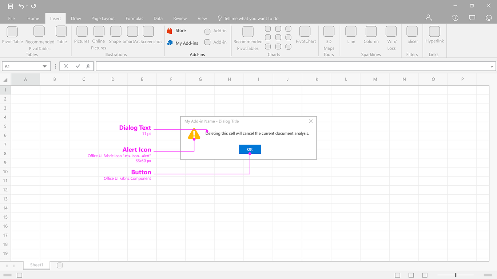
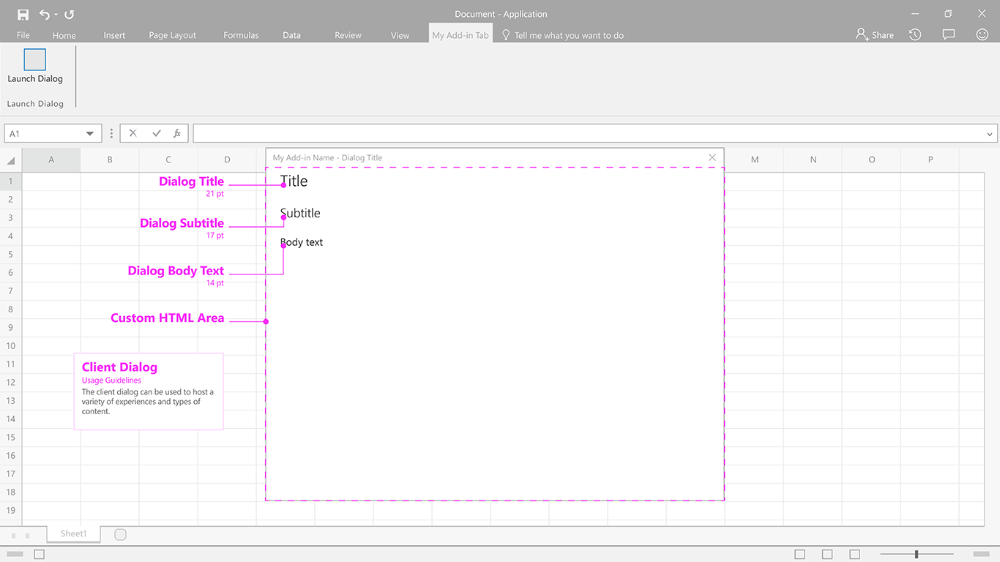
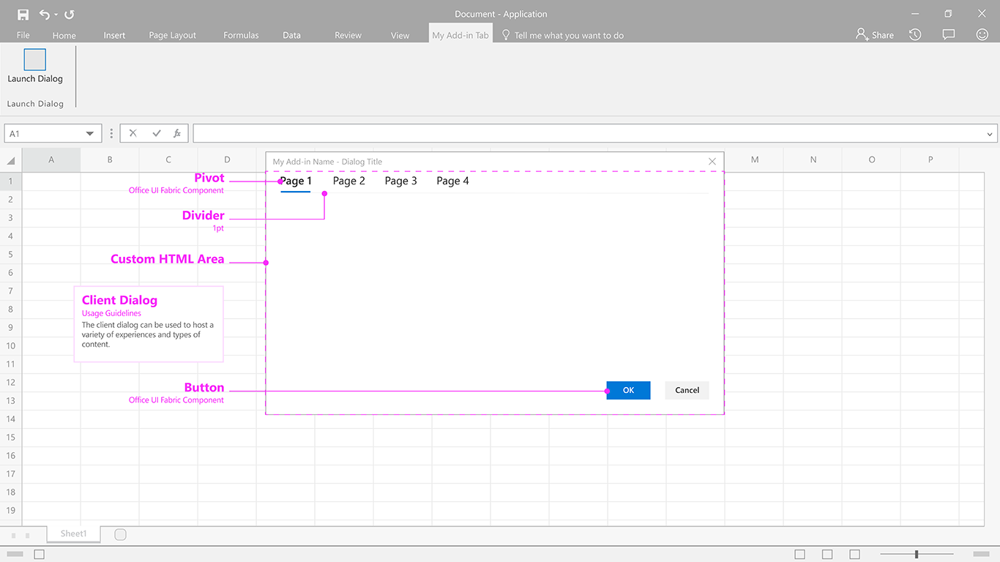

### Client Dialog

Client dialog boxes provide another way for users to work with your add-in outside of a task pane.

Current Fabric Version Used: [2.6.1](https://github.com/OfficeDev/office-ui-fabric-core/releases/tag/2.6.1)

* [Download .Ai (Adobe Illustrator) file](https://github.com/OfficeDev/Office-Add-in-UX-Design-Patterns/blob/master/Patterns/Source%20Files/Client_Dialog.ai?raw=true)
* Code
 * [Client Dialog Alert](https://github.com/OfficeDev/Office-Add-in-UX-Design-Patterns-Code/tree/master/templates/dialog/alert)
 * [Client Dialog with Type Ramp](https://github.com/OfficeDev/Office-Add-in-UX-Design-Patterns-Code/tree/master/templates/dialog/typeramp)
 * [Client Dialog with Navigation](https://github.com/OfficeDev/Office-Add-in-UX-Design-Patterns-Code/tree/master/templates/dialog/navigation)

***

Client Dialog - Alert - Specifications for desktop 

Client Dialog - Generic with Typeramp  - Specifications for desktop

Client Dialog - Generic with Navigation - Specifications for desktopß
