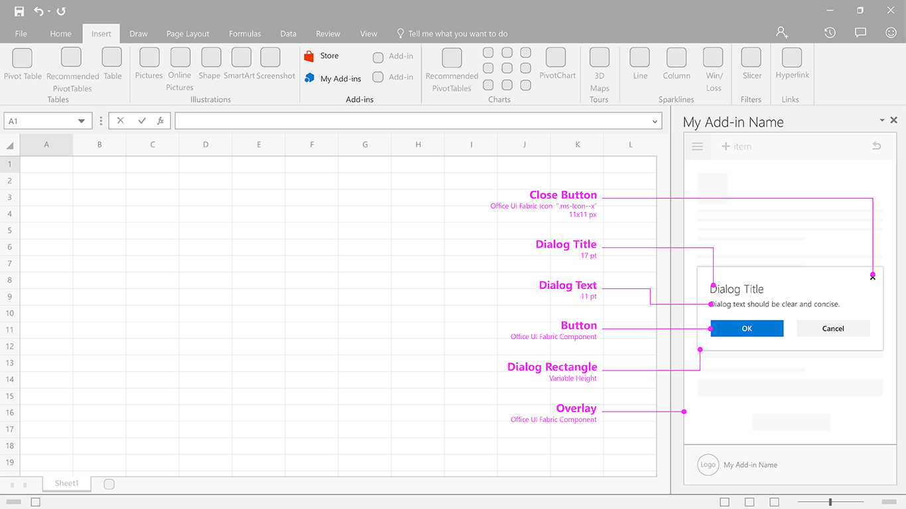

# Embedded Dialog

Embedded dialog shows a dialog inside the task pane that provides information and, optionally, an interactive experience, using buttons or other controls. Consider using one to prompt a user to confirm an action.

#### Code sample
* [Embedded dialog code sample](../templates/notifications/embedded-dialog)

***

Specifications for desktop task pane
