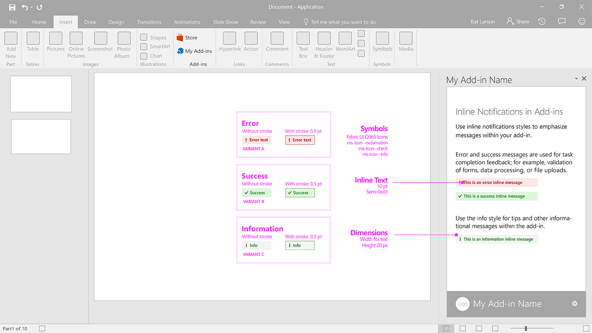

### Notification - Inline Message

Inline message indicates error, success, or information, and it can appear at a specified location in the task pane. For example, if a user enters an improperly formatted email address in a text box, an error message appears just below the text box.

Current Fabric Version Used: [2.6.1](https://github.com/OfficeDev/office-ui-fabric-core/releases/tag/2.6.1)

* [Code sample](https://github.com/OfficeDev/Office-Add-in-UX-Design-Patterns-Code/tree/master/templates/notifications/inline-message)
* [Download .Ai (Adobe Illustrator) file](https://github.com/OfficeDev/Office-Add-in-UX-Design-Patterns/blob/master/Patterns/Source%20Files/Notification_Inline_Message.ai?raw=true)

***

Specifications for desktop task pane
