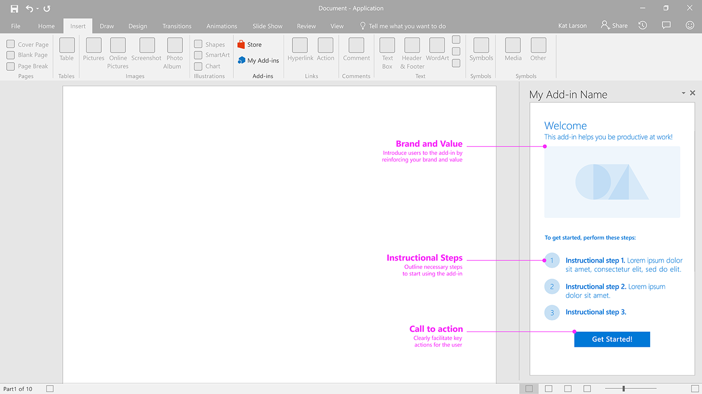

### First Run - Steps To Start

Steps to start provides users with an ordered list of steps to perform to get started using your add-in.

Current Fabric Version Used: [2.6.1](https://github.com/OfficeDev/office-ui-fabric-core/releases/tag/2.6.1)

* [Code sample](https://github.com/OfficeDev/Office-Add-in-UX-Design-Patterns-Code/tree/master/templates/first-run/instruction-step)
* [Download .Ai (Adobe Illustrator) file](https://github.com/OfficeDev/Office-Add-in-UX-Design-Patterns/blob/master/Patterns/Source%20Files/FirstRun_StepsToStart.ai?raw=true)

***

Specifications for desktop task pane

