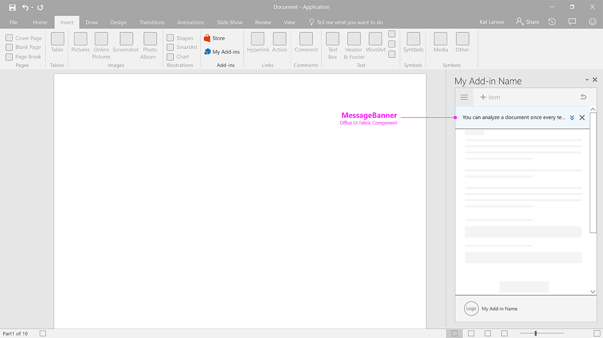

### Notification - MessageBanner

Message banner provides information and, optionally, a simple call to action, in a banner that can be collapsed to a single line, expanded to multiple lines, or dismissed. Consider using message banners to report a service update or a helpful tip when the add-in starts.

Current Fabric Version Used: [2.6.1](https://github.com/OfficeDev/office-ui-fabric-core/releases/tag/2.6.1)

* [Code sample](https://github.com/OfficeDev/Office-Add-in-UX-Design-Patterns-Code/tree/master/templates/notifications/message-banner)
* [Download .Ai (Adobe Illustrator) file](https://github.com/OfficeDev/Office-Add-in-UX-Design-Patterns/blob/master/Patterns/Source%20Files/Notification_messagebanner.ai?raw=true)

***

Specifications for desktop task pane
