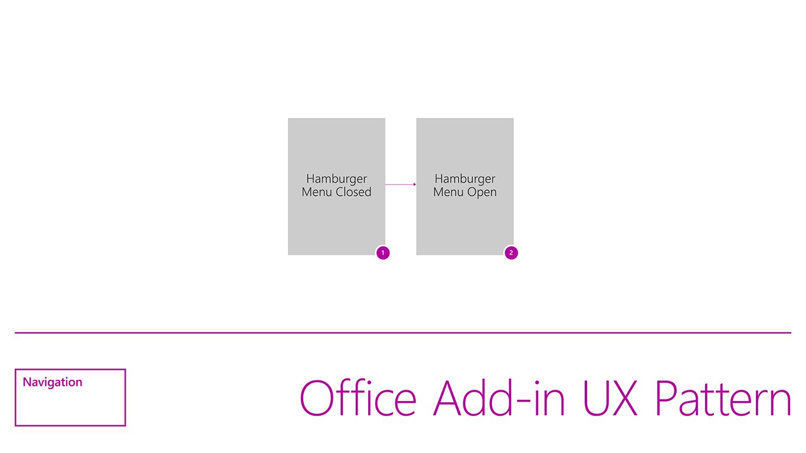

### Navigation

Shows a menu, commonly referred to as the hamburger menu, with page menu items in a task pane. 

Current Fabric Version Used: [2.6.1](https://github.com/OfficeDev/office-ui-fabric-core/releases/tag/2.6.1)

* [Code sample](https://github.com/OfficeDev/Office-Add-in-UX-Design-Patterns-Code/tree/master/templates/navigation/navigation)
* [Download .Ai (Adobe Illustrator) file](https://github.com/OfficeDev/Office-Add-in-UX-Design-Patterns/blob/master/Patterns/Source%20Files/Navigation.ai?raw=true)

***

Flowchart and title page

1. Specifications for desktop task pane 

