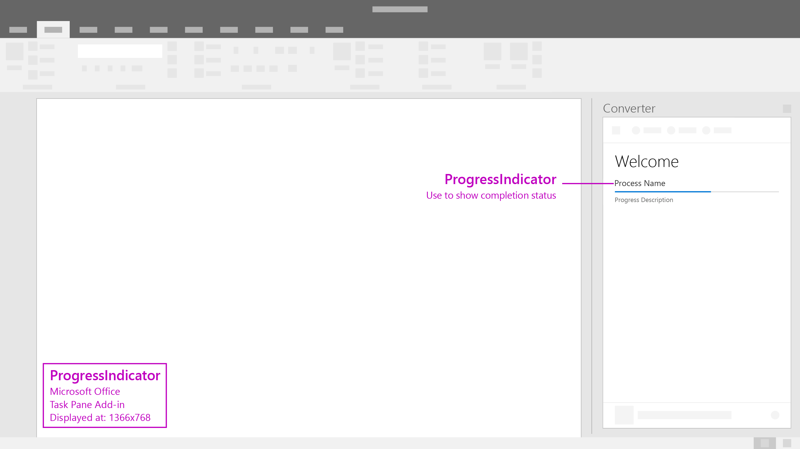

# Progress Indicator

Progress Indicator shows the progress of a long-running, synchronous process, such as a configuration task that must complete before the user can take any further action. It is a separate interstitial page that also reinforces the add-in brand. Use a progress bar when the process can send periodic measures of how far along it is back to the add-in.

#### Code sample
  * [Progress indicator code sample](../templates/notifications/progress-indicator)

***

Specifications for desktop task pane

