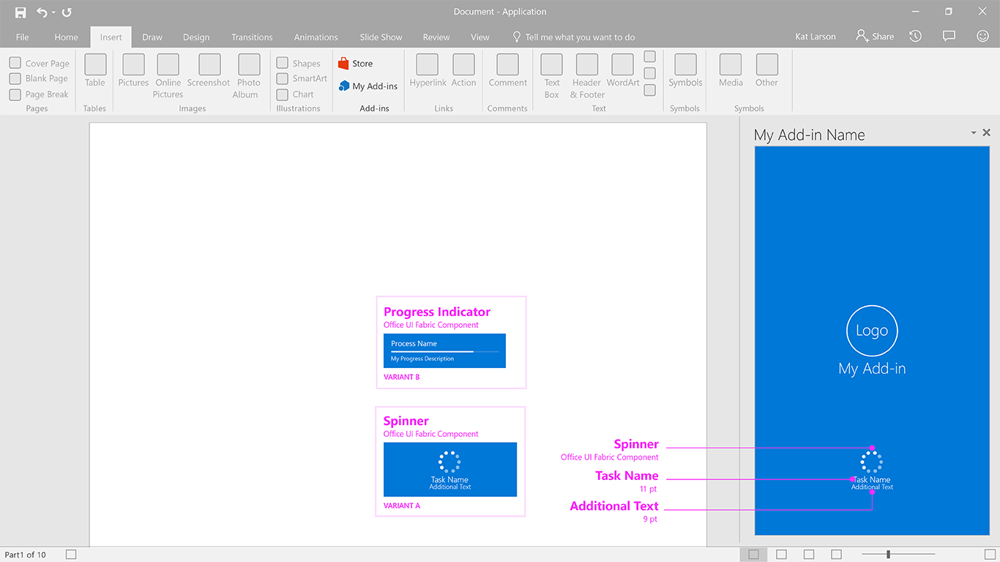

# Spinner 

Spinner indicates that a long-running, synchronous process is underway, but provides no indication of how far along it is. It is a separate interstitial page that also reinforces the add-in brand. Use a spinner when the add-in cannot know reliably how far along a process is.

#### Code sample
  * [Spinner code sample](../templates/notifications/spinner)

***

Specifications for desktop task pane

