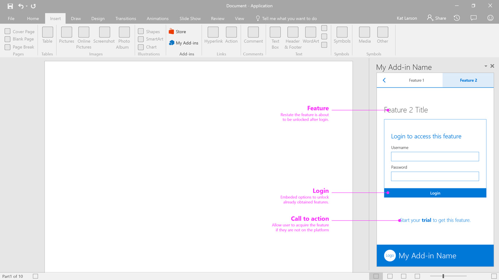

# Trial Feature

Trial Feature allows unlocking a feature in an add-in, and signing-up for a trial version of the add-in.

#### Code sample
* [Trial feature code sample](../templates/first-run/trial-feature)

***

Specifications for desktop task pane

