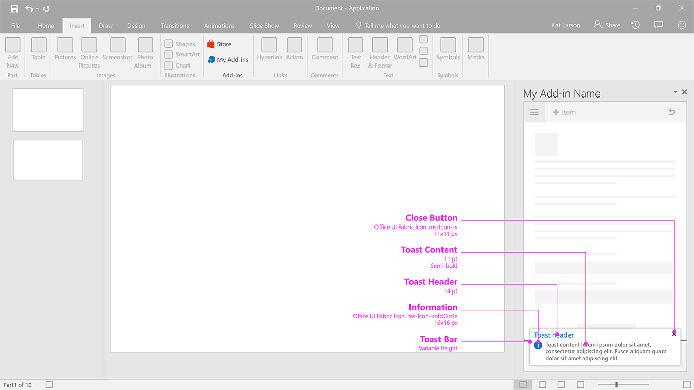

### Notification - Toast

Toast provides a brief message that fades away after a few seconds. Since the user might not see the message, use toast only for inessential information. It is a good choice for notifying users of an event in a remote system, such as the receipt of an email.

Current Fabric Version Used: [2.6.1](https://github.com/OfficeDev/office-ui-fabric-core/releases/tag/2.6.1)

* [Code sample](https://github.com/OfficeDev/Office-Add-in-UX-Design-Patterns-Code/tree/master/templates/notifications/toast)
* [Download .Ai (Adobe Illustrator) file](https://github.com/OfficeDev/Office-Add-in-UX-Design-Patterns/blob/master/Patterns/Source%20Files/Notification_toast.ai)

***

Specifications for desktop task pane